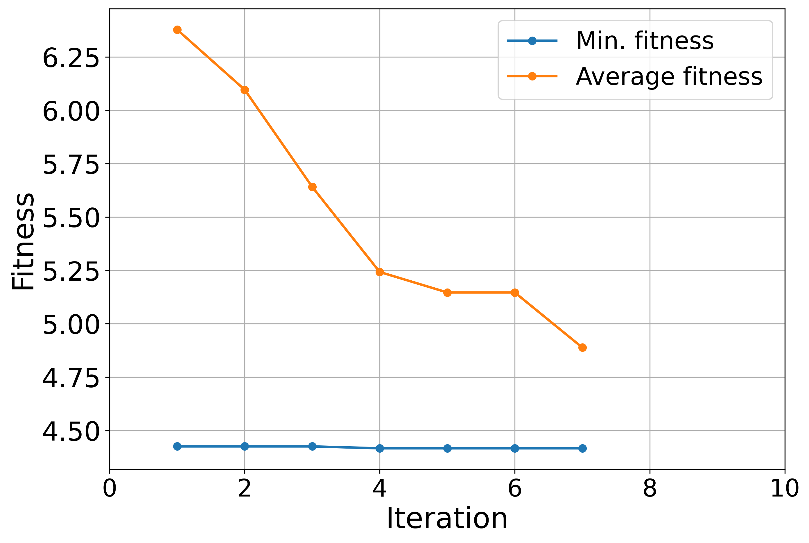
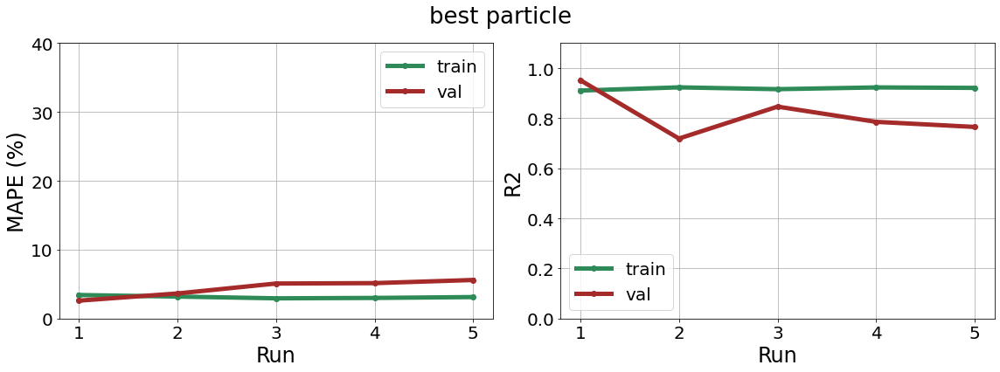
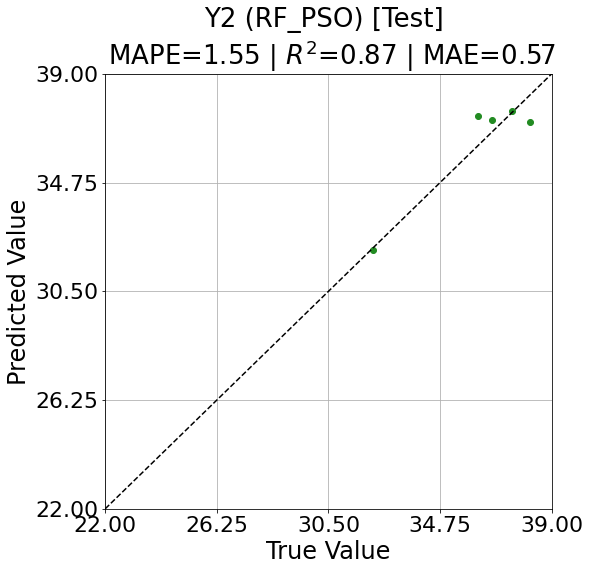

<br>
<h1 align="center">
PSO_XX.py
</h1>
<h2 align="center">
Constructing machine learning models to predict the qualities based on input signals, while using Particle Swarm Optimization (PSO).
</h2>

### Time to **predict the resultant quality** of machining process with ***working parameters*** or ***extracted signal features***.

**[Review of the imaginary machining scenario](README.md "link" )**

**[Review of the extraction of signal features](featureExtraction.md "link" )**

```
import signal_processing as sigpro

signals_runs = sigpro.get_signals('.\\demonstration_signal_dataset', first_signal_minus=False)
sample_rate = int(20000/10)
y = np.genfromtxt('demo_y.csv', delimiter=',')
siganl_idx_demo = 3
signal_runs = sigpro.pick_one_signal(signals_runs, signal_idx=siganl_idx_demo)
time_runs = sigpro.pick_one_signal(signals_runs, signal_idx=0)
y_idx_demo = 1
```

This page will show you how to train a **machine learning model** using **PSO**.

### [What is PSO?](https://towardsdatascience.com/particle-swarm-optimization-visually-explained-46289eeb2e14 "link" )

Let's extracted **frequency features** using ***featureExtraction.py***.

Then try training a  ***[Random Forest model](https://www.youtube.com/watch?v=J4Wdy0Wc_xQ "link")***, while using **domain frequency energies** as ***inputs***, and **surface quality value 2** *(y2)* as the ***output***.

The **hyperparameters of the model** will be adjusted during **PSO** iterations. 

There are  **other machine learning model** that can be trained using .py files resembling ***psoXXX***, such as *XGBoost*, *KNN*, *SVM*, etc. They share **similar operation process**, so be sure to try them out at your will.

Now, the **example** focusse on the **PSO** and **testing results** of the **Random Forest** model.

```
import featureExtraction as feaext
import cross_validation as cv
from classPSO_kNN import psokNN
from classPSO_XGB import psoXGB
from classPSO_RF import psoRF

features_freq = feaext.FreqFeatures(signal_runs, sample_rate, num_wanted_freq=3)
domain_energy = features_freq.domain_energy
pso_prepare = psoRF(domain_energy, y[:, y_idx_demo], f'Y{y_idx_demo}', y_boundary=[22, 39])
model, history, hyper_param_set = pso_prepare.pso(particleAmount=5, maxIterTime=10)
```




