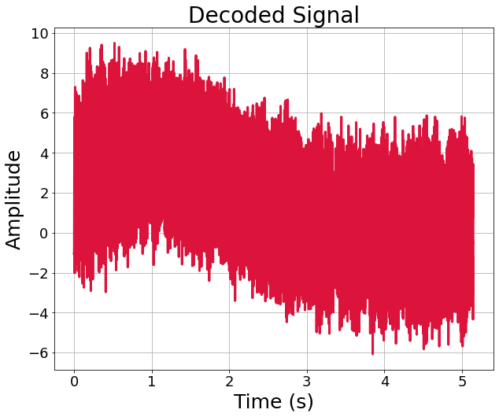

<h1 align="center">
autoencoder.py
</h1>
<h2 align="center">
Extracting features from the signals using neural networks
</h2>

### This method is often used in the monitoring of machining processes, as it can automatically detect the anomaly happening during the process.

### Such a ability is based on ***Autoencoder's*** *(AE)* innate **reconstruction capability**.

### But in this page, I will just showcase how to exploit AE to extract signals' characteristics.

### [What is AE?](https://www.jeremyjordan.me/autoencoders/ "link" )

Before we go further, let's load our datasets made by [waveMaker.py](waveMaker.md "link" ).

To focus on the topic, we only deal with the **3rd signals** recorded from all process runs.

If you want to see what this signal looks like, go check [detail of signal_processing.py](signal_processing.md "link" )

```
signals_runs = sigpro.get_signals('.\\demonstration_signal_dataset', first_signal_minus=False)
sample_rate = int(20000/10)
y = np.genfromtxt('demo_y.csv', delimiter=',')
siganl_idx_demo = 3
signal_runs = sigpro.pick_one_signal(signals_runs, signal_idx=siganl_idx_demo)
time_runs = sigpro.pick_one_signal(signals_runs, signal_idx=0)
```

[Reference of constricting AE](https://www.tensorflow.org/tutorials/generative/autoencoder "link" )

```
class Autoencoder(Model):
      def __init__(self, latent_dim, shape):
        super(Autoencoder, self).__init__()
        self.latent_dim = latent_dim
        self.shape = shape
        self.encoder = tf.keras.Sequential([
            layers.Dense(latent_dim, input_shape=shape, activation='relu'),
            # layers.Dropout(0.1),
            layers.Dense(latent_dim//2, activation='relu'),
            # layers.Dropout(0.1),
            # layers.Dense(latent_dim//10, activation='relu')
        ])
        self.decoder = tf.keras.Sequential([
            layers.Dense(latent_dim, activation='relu'),
            # layers.Dropout(0.1),
            layers.Dense(tf.math.reduce_prod(shape).numpy(), activation='linear'),
            layers.Reshape(shape)
        ])
    
      def call(self, x):
        encoded = self.encoder(x)
        decoded = self.decoder(encoded)
        return decoded
```

```
signals_resize, time_resize = sigpro.signal_resize(signal_runs, time_runs, final_length=min([run.shape[0] for run in signal_runs]))
ae_model, ae_train_history = ae.train_AE(signals_resize, shrink_rate=100)
encoded_signal = ae_model.encoder(signals_resize).numpy()
decoded_signal = ae_model.decoder(encoded_signal).numpy()

sigplot.draw_signal(signal_runs[run_idx_demo], time_runs[run_idx_demo], color_='royalblue', title='OG Signal')
sigplot.draw_signal(signals_resize[run_idx_demo], time_resize[run_idx_demo], color_='seagreen', title='Resized Signal')
sigplot.draw_signal(encoded_signal[run_idx_demo], color_='peru', title='Encoded Signal')
sigplot.draw_signal(decoded_signal[run_idx_demo], time_resize[run_idx_demo], color_='crimson', title='Decoded Signal')
```


