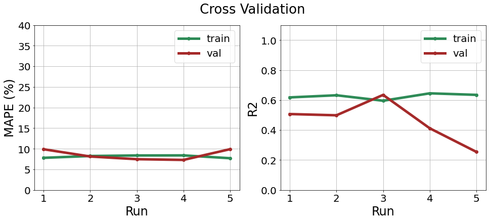
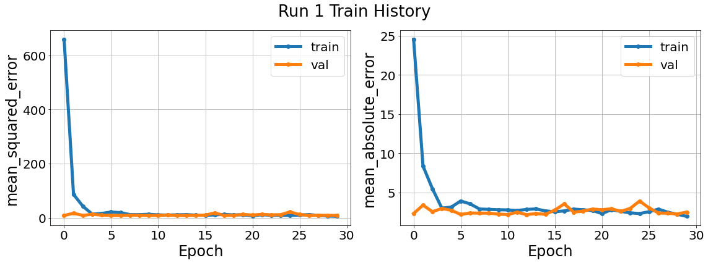
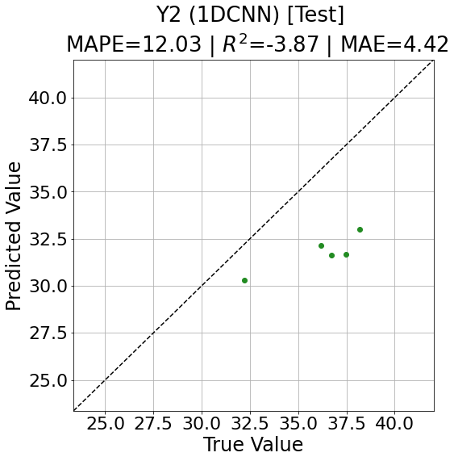

<br>
<h1 align="center">
cross-validation.py
</h1>
<h2 align="center">
Constructing machine learning models to predict the qualities based on input signals.
</h2>

### Time to **predict the resultant quality** of machining process with ***working parameters*** or ***extracted signal features***.

**[Review of the imaginary machining scenario](README.md "link" )**

**[Review of the extraction of signal features](featureExtraciton.md "link" )**

```
import signal_processing as sigpro

signals_runs = sigpro.get_signals('.\\demonstration_signal_dataset', first_signal_minus=False)
sample_rate = int(20000/10)
y = np.genfromtxt('demo_y.csv', delimiter=',')
siganl_idx_demo = 3
signal_runs = sigpro.pick_one_signal(signals_runs, signal_idx=siganl_idx_demo)
time_runs = sigpro.pick_one_signal(signals_runs, signal_idx=0)
y_idx_demo = 1
```

This page will show you how to train a **machine learning model** using **cross validaiton**.

### [What is cross validaiton?](https://scikit-learn.org/stable/modules/cross_validation.html"link" )

Let's extracted **frequency features** using ***[featureExtraciton.md](featureExtraciton.md "link" )***.

Then try training a  ***[XGBoost model](https://www.youtube.com/watch?v=OtD8wVaFm6E "link")***, while using **domain frequency energies** as ***inputs***, and **surface quality value 2** *(Y2)* as the ***output***.

You can change the **hyperparameters of the model** using a **dictionary argument** of . In this case, that is ***param_setting***.

Besides that, you can see a **trained model** is established **after** calling ***cross_validate_XGB()***. Not cross_validate().

There are many **other machine learning model** that can be trained using function resembling ***cross_validate_XXX()***, such as *SVR*, *Random Forest*, *KNN*, etc.

Now, the **example** focusse on the **cross validation** and **testing results** of the **XGBoost** model.

BTW, the fold number is 5 in default

```
import featureExtraction as feaext
import cross_validation as cv

features_freq = feaext.FreqFeatures(signal_runs, sample_rate, num_wanted_freq=3)
domain_energy = features_freq.domain_energy
cv_prepare = cv.cross_validate(domain_energy, y[:, y_idx_demo], qualityKind=f'Y{y_idx_demo}', fold_num=5)
param_setting = {'eta':0.3, 'gamma':0.01, 'max_depth':6, 'subsample':0.8, 'lambda':50, 'random_state':75}
trained_model = cv_prepare.cross_validate_XGB(param_setting=param_setting)
cv_prepare.model_testing(trained_model, 'XGB')
```


Now let's see the **cross validaiton** and **testing results** of a **DNN** model.

This time, I want to use the **statistical feature** of the signal as ***inputs***.

The argument ***dense_coeff*** controls the **number of neurons** in the hidden layers.

```
features_time = feaext.TimeFeatures(signal_runs,target_lst=['rms', 'kurtosis', 'skewness', 'variance', 'p2p'])
features = features_time.features_all_signals
cv_prepare = cv.cross_validate(features, y[:, y_idx_demo], qualityKind=f'Y{y_idx_demo}', fold_num=5)
trained_model = cv_prepare.cross_validate_DNN(dense_coeff=10)
cv_prepare.model_testing(trained_model, 'DNN')
```




Besides scalar features we used above, we can try using **signal** itself, or even **signal images** as ***inputs*** to train **Neural Networks**.

Start with **1D-CNN** first, which accepts **strings of signal** as its **input**.

But before that, we need to **unify the signal length** of samples, or else 1D-CNN won't bother trying to eat it.

```
signal_resize_coeff = 1000
signals_resize, time_resize = sigpro.signal_resize(signal_runs, time_runs, signal_resize_coeff)
cv_prepare = cv.cross_validate_signal(signals_resize, y[:, y_idx_demo], qualityKind=f'Y{y_idx_demo}', fold_num=5)
trained_model = cv_prepare.cross_validate_1DCNN(dense_coeff=4)
cv_prepare.model_testing(trained_model, '1DCNN')
```





Now we go with **2D-CNN**, which accepts **layers of images** as its **input**.

Therefore, we need to **unify the signal length** and **transform signals into images**. 

The **order** may **affect the training result**, so be sure to try **"unify length first then make images"**, and **the other way around**, then see of which the result is better for you.


```
signal_resize_coeff = 500
signals_resize, time_resize = sigpro.signal_resize(signal_runs, time_runs, signal_resize_coeff)
signals_imgs = sigpro.signals_to_images(signals_resize, method='cwt')
signals_imgs = sigpro.images_resize_lst(signals_imgs, size=img_resize_coeff)
sigplot.draw_signal_2d(signals_imgs[run_idx_demo])

cv_prepare = cv.cross_validate_image(signals_imgs, y[:, y_idx_demo], qualityKind=f'Y{y_idx_demo}', fold_num=5)
trained_model = cv_prepare.cross_validate_2DCNN(dense_coeff=10)
cv_prepare.model_testing(trained_model, '2DCNN')
```


